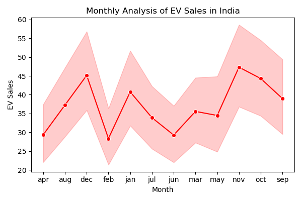
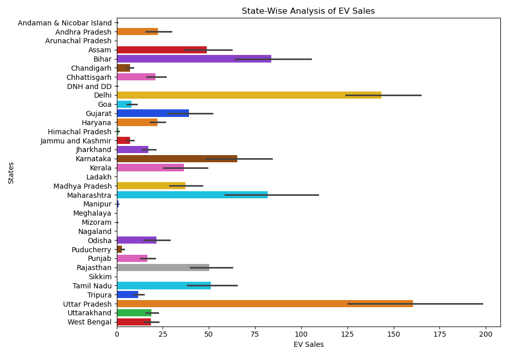
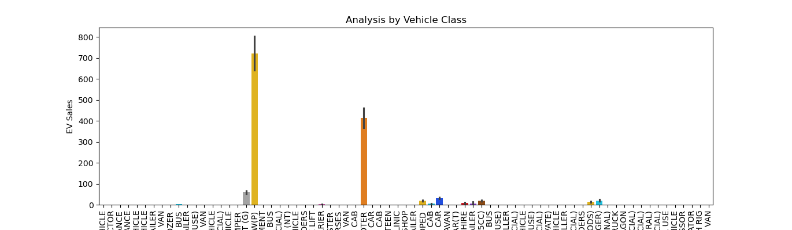
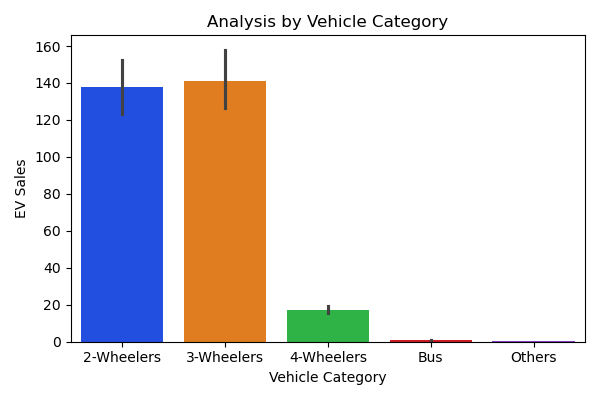
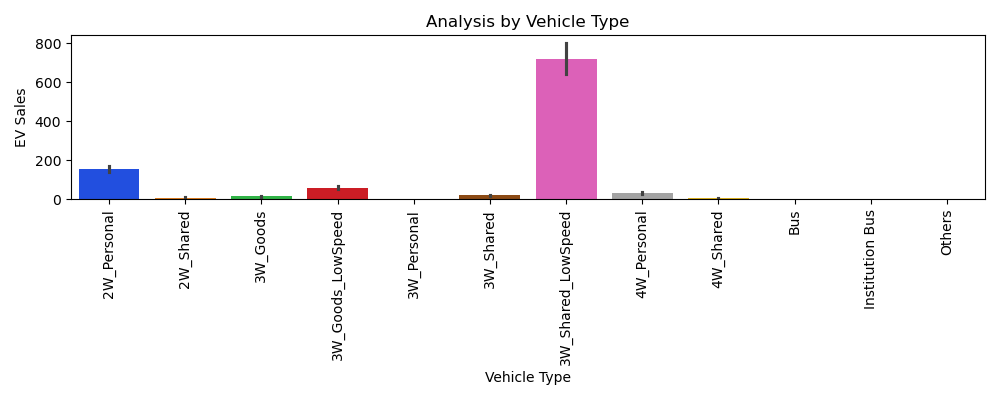

# 📊 Electric Vehicle Sales Analysis in India

This project analyzes **Electric Vehicle (EV) sales in India** from 2014 to 2023 using the dataset `Electric Vehicle Sales by State in India.csv`.  
We perform data cleaning, preprocessing, and visualization to understand sales trends across years, months, states, and vehicle categories.  

---

## 📂 Dataset Overview
- **Rows:** 96,845  
- **Columns:** 8  
- **Features:** Year, Month, Date, State, Vehicle Class, Vehicle Category, Vehicle Type, EV Sales Quantity  

---

## 🔍 Key Insights
1. EV adoption has been **growing steadily** year by year.  
2. **Two-wheelers dominate** the EV sales market in India.  
3. States like **Maharashtra, Karnataka, and Uttar Pradesh** have the highest EV adoption.  
4. Seasonal/monthly variations in sales are visible.  

---

## 📈 Visualizations

### 1. Yearly EV Sales Trend


### 2. Monthly EV Sales Trend


### 3. State-Wise EV Sales


### 4. EV Sales by Vehicle Class


### 5. EV Sales by Vehicle Category


### 6. EV Sales by Vehicle Type


---

## ⚙️ Tech Stack
- **Python**
- **Pandas / NumPy** – Data Handling  
- **Matplotlib / Seaborn** – Visualization  

---

## 🚀 How to Run
```bash
# Clone repo and install dependencies
pip install pandas numpy matplotlib seaborn

# Run the analysis
python ev_analysis.py
